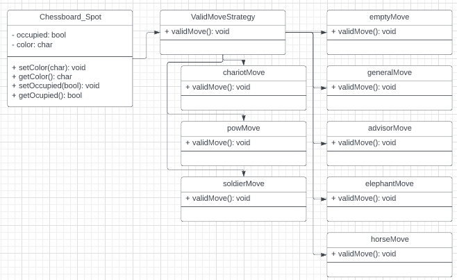

# Chinese Chess
 
 > Authors: [Ying-Jia(Samuel) Lin](https://github.com/SamuelLin213), [Will Huang](https://github.com/whuan126), [Jacqueline Gardea](https://github.com/jlgardea), [Dylan Talmood](https://github.com/dtalmood)
 
## Project Description
 > * The project is important and interesting to us, as it allows us to learn a new game and explore Chinese Chess using C++ implementation. Additionally, Chinese Chess provides a different perspective, in contrast to the traditional chess that most people are familiar with. There's a lot to consider when creating Chinese Chess, as opposed to traditional Chess. 
 > * At this moment, we plan to use C++ as the main language of the project, alongside the Linux terminal, which will provide the "front-end" aspect of the project.
 > * The project will take in the piece selection and a pair of coordinates, in order to allow users to move a specific piece, to specific coordinates. After every move, the terminal clear the screen and output the new board. When a game is won, the program will stop prompting for piece selection and coordinate inputs, and will output a message indicating the victory or loss. Additionally, the program will implement the function to save and load games, via data saved into a local .txt file. When the program first runs, it will read the data from the local directory, and prompt the user whether they would like to continue from the saved game. Users will also have the option to save the current game, which leads to the coordinates/data of the game being loaded into the .txt file. Symbols on the terminal output, alongside a index at the side, will represent each Chess piece. 
 
## Class Diagram
 
 > * The Chessboard class represents the playing board and is composed of objects of the Chessboard Spot class. This class contains data members describing the occuptation status(piece and color) of each spot. Each spot is composed of a Piece object, which is a base class from which all the separate pieces inherit from(general, soldier, cannon, elephant, chariot, guard, horse). Enums are used for the piece names and the player colors. 

## Design Pattern
 > * The strategy design pattern occurs with the piece class, which allows for the right variation of the validMove() function to be called, when checking that the next move is valid, according to the allowed movement for each piece. 
 > * We picked the strategy design pattern, as it allows us to choose which validMove() function is called for the piece class. This way, only specific rules are checked, when it comes to ensuring the next moves are valid. 
 > * The strategy design pattern allowed us to write better code, by separating the verification of the next move into different classes, and have the right variation of the function be called. 
  
 > ## Final deliverable
 > All group members will give a demo to the TA/reader during lab time. The TA/reader will check the demo and the project GitHub repository and ask a few questions to all the team members. 
 > Before the demo, you should do the following:
 > * Complete the sections below (i.e. Screenshots, Installation/Usage, Testing)
 > * Plan one more sprint (that you will not necessarily complete before the end of the quarter). Your In-progress and In-testing columns should be empty (you are not doing more work currently) but your TODO column should have a full sprint plan in it as you have done before. This should include any known bugs (there should be some) or new features you would like to add. These should appear as issues/cards on your Project board.
 > * Make sure your README file and Project board are up-to-date reflecting the current status of your project (e.g. any changes that you have made during the project such as changes to your class diagram). Previous versions should still be visible through your commit history. 
 
 ## Screenshots
 > Screenshots of the input/output after running your application
 ## Installation/Usage
 > Instructions on installing and running your application
 ## Testing
 > How was your project tested/validated? If you used CI, you should have a "build passing" badge in this README.
 
